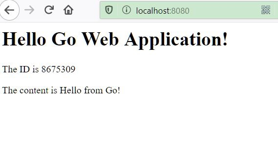
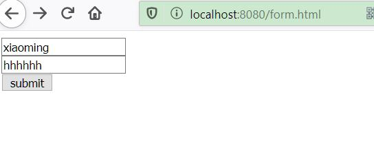
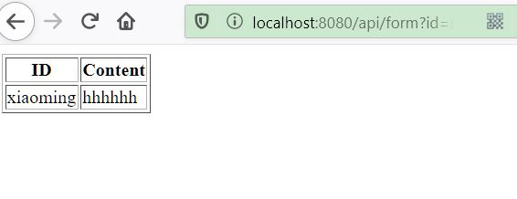
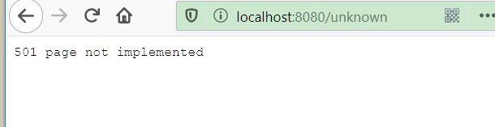

# cloudgo

16327109 谢昆成

## 概述

设计一个 web 小应用，展示静态文件服务、js 请求支持、模板输出、表单处理、Filter 中间件设计等方面的能力。（不需要数据库支持） 

## 实验要求

1. 支持静态文件服务
2. 支持简单 js 访问
3. 提交表单，并输出一个表格
4. 对 `/unknown` 给出开发中的提示，返回码 `5xx`


## 实验内容

### 1. 支持静态文件服务

使用`http.Handle("/",http.FileServer(http.Dir("assets")))`即可将"/"为 前缀的 URL 都定位到 `"/assets/"` 为虚拟根目录的文件系统。

使用课程给的样例index.html ，放入assets/下。

html

```html
<html>

<head>
    <!-- <link rel="stylesheet" href="css/main.css" /> -->
    <script src="http://code.jquery.com/jquery-latest.js"></script>
    <script src="js/hello.js"></script>
</head>

<body>
    <h1>Hello Go Web Application!</h1>
    <div>
        <p class="greeting-id">The ID is </p>
        <p class="greeting-content">The content is </p>
    </div>
</body>

</html>
```

结果



### 2. 支持简单 js 访问

js用ajax访问/api/test

```js
$(document).ready(function () {
    $.ajax({
        url: "/api/test",
        success: function (data) {
            data = JSON.parse(data)
            $('.greeting-id').append(data.id);
            $('.greeting-content').append(data.content);
        }
    })
});
```

html

```html
<html>

<head>
    <!-- <link rel="stylesheet" href="css/main.css" /> -->
    <script src="http://code.jquery.com/jquery-latest.js"></script>
    <script src="js/hello.js"></script>
</head>

<body>
    <h1>Hello Go Web Application!</h1>
    <div>
        <p class="greeting-id">The ID is </p>
        <p class="greeting-content">The content is </p>
    </div>
</body>

</html>
```

```go
func apiTestHandler(w http.ResponseWriter, req *http.Request) {
	json.NewEncoder(w).Encode(struct {
		ID      string `json:"id"`
		Content string `json:"content"`
	}{ID: "8675309", Content: "Hello from Go!"})
}
```


结果


### 3. 提交表单，并输出一个表格

使用html/template 渲染表格模板table.html

```html
<html>

<head>
  <!-- <link rel="stylesheet" href="css/main.css"/> -->
</head>

<body>
  <table border="1">
    <tr>
      <th>ID</th>
      <th>Content</th>
    </tr>
    <tr>
      <td class="greeting-id">{{.ID}}</td>
      <td class="greeting-content">{{.Content}}</td>
    </tr>
  </table>
</body>

</html>
```

```go
func homeHandler(w http.ResponseWriter, req *http.Request) {
	u := struct {
		ID      string `json:"id"`
		Content string `json:"content"`
	}{ID: req.URL.Query().Get("id"), Content: req.URL.Query().Get("content")}

	templ, _ := template.ParseFiles("assets/templates/table.html")
	templ.Execute(w, u)
	w.Header().Set("Content-Type", "text/html")
}
```






### 4. 对 `/unknown` 给出开发中的提示，返回码 `5xx`

```go
func unknown(w http.ResponseWriter, r *http.Request) {
    http.Error(w, "501 page not implemented", http.StatusNotImplemented)
}
```





